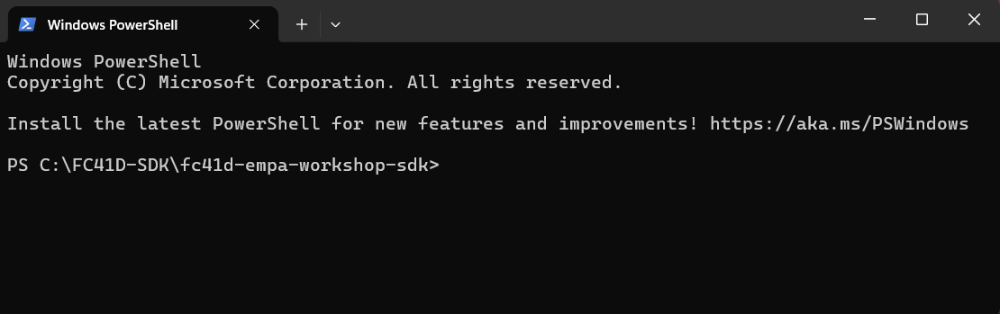

# EMPA QUECTEL WORKSHOP FC41D DEMOLARI

# İçindekiler

1. [FC41D Demoları](#fc41d-demoları)
2. [FC41D QuecOpen - SDK Derleme](#fc41d-quecopen---sdk-derleme)
3. [FC41D QuecOpen - Derlenen Yazılımı Karta Yükleme](#fc41d-quecopen---derlenen-yazılımı-karta-yükleme)

# FC41D Demoları

Demolarımızı gerçekleştirebilmek için ql_app.c dosyasında değişiklikler yapmamız gerekiyor. (Örnek dosya yolu : `C:\FC41D-SDK\fc41d-empa-workshop-sdk\ql_application\ql_app.c`)
Demolar ise `C:\FC41D-SDK\fc41d-empa-workshop-sdk\ql_application\empa_qec_workshop`
içerisinde bulunuyor. Buradaki dosyalar [empa_qec_workshop](empa_qec_workshop/)
klasöründe bulunmaktadır.

Öncelikle modülün düzgün bir şekilde çalıştığından emin olmak ve gerekli başlangıç işlemlerinin gerçekleştirilebilmesi için 
  ```c
   /* FC41D Init Section Start */
   /* FC41D Init Section End */
   ```
   yorum satırları arasındaki kodları yorum satırından çıkarın. 
   
   Buradaki satırlar bütün demolar için kullanılacaktır yani sürekli yorum satırından çıkarılmış halde olması gerekmektedir.

   
## PWM ve UART DEMO

Bu demoyu derlemek için aşağıdaki yorum satırlarının arasındaki PWM için gerekli config, start ve demo fonksiyonlarının bulunduğu kodları yorum satırından çıkarın.
```c
   /* FC41D UART PWM Demo Section Start */
   /* FC41D UART PWM Demo Section End */
```

Ardından derleme ve derlenen yazılımın kartına yükleme  işlemlerini tamamlayın.

Uygulamada başlangıçta 1 Hz ve %50 duty'ye sahip bir PWM ile başlar. UART Terminali üzerinden (Örneğin **Tera Term**) frekans,duty şeklinde gönderin.

Aşağıda örnek bir seri terminal çıktısını görebilirsiniz:

```c
FC41D Initialized

PWM config success.
PWM started.
Enter PWM Frequency,Duty: 1,150

Invalid duty cycle. It must be between 0 and 100.
Enter PWM Frequency,Duty: 150,90

150 Hz , 90 % duty PWM generated

150

Wrong message format. Empty duty value.
Enter PWM Frequency,Duty: 1,60

1 Hz , 60 % duty PWM generated
2,60

2 Hz , 60 % duty PWM generated
,5654,

Wrong message format. Empty duty value.
Enter PWM Frequency,Duty: 5,190

Invalid duty cycle. It must be between 0 and 100.
Enter PWM Frequency,Duty: 1000,50

1000 Hz , 50 % duty PWM generated
1,50

1 Hz , 50 % duty PWM generated
```


## EMPA ADC DEMO

ADC demosunu derleyebilmek için aşağıdaki yorum satırlarının arasındaki ADC için gerekli kod satırlarını yorum satırından çıkarın.
```c
/* FC41D ADC  Demo Section Start */
/* FC41D ADC  Demo Section End */
```

Ardından derleme ve derlenen yazılımın kartına yükleme  işlemlerini tamamlayın.

Aşağıda örnek seri terminal çıktısını görebilirsiniz:

```c
FC41D Initialized

ADC Channel1 initalized.
ADC Channel1 started.
ADC Channel1 voltage:1663 mV
ADC Channel1 voltage:1663 mV

```

## EMPA BLE DEMO

BLE demosunu derleyebilmek için aşağıdaki yorum satırlarının arasındaki BLE için gerekli kod satırlarını yorum satırından çıkarın.
```c
/* FC41D BLE  Demo Section Start */
/* FC41D BLE  Demo Section End */
```

Ardından derleme ve derlenen yazılımın kartına yükleme  işlemlerini tamamlayın.

Bu demoda WIFI Provisioning işlemi için LightBlue BLE uygulaması kullanılmaktadır.

Uygulamayı gerçekleştirmek için herhangi bir BLE uygulamasını da kullanabilirsiniz.

Uygulama ile BLE ile karşılıklı veri aktarımı yapılabilmektedir.

## MQTT DEMO
MQTT demosunu derleyebilmek için aşağıdaki yorum satırlarının arasındaki MQTT için gerekli kod satırlarını yorum satırından çıkarın.
```c
/* FC41D MQTT  Demo Section Start */
/* FC41D MQTT  Demo Section End */
```
ql_app.c içerisindeki clientID, url, username, ve password kısımlarını, kullanmakta olduğunuz MQTT broker'ından (örneğin HiveMQ) alıp, bunları aşağıdaki struct içerisinde değiştirin.
```c
MQTTConfig config =
    {
        .clientID = "clientID",
        .username = "username",
        .password = "password",
        .url = "url",
        .port = 8883,
        .keepAliveInterval = 30000,
        .cleanSession = 1,
        .topicSub = "/topic/A1",
        .topicPub = "/topic/genel"};
```
Derleme ve karta yükleme işlemlerini gerçekleştirin. Demo başlar ve ardından WIFI Provisioning işlemi için BLE advertising işlemine başlar.

Bu demoda WIFI Provisioning işlemi için LightBlue BLE uygulaması kullanılmaktadır.

Uygulamayı gerçekleştirmek için herhangi bir BLE uygulamasını da kullanabilirsiniz.

BLE adresi terminal üzerinden loglanmaktadır. Log çıktılarından BLE adresine görseldeki gibi Connect'e tıklayın.


Ardından görseldeki Hex kısmına tıklayalım 


ve UTF-8 String seçeneğini seçin ve Save seçeneğine tıklayın.


Ardından ana menüye dönün ve **Write new value** seçeneğini seçin.


Ve ```CONNECT=<SSID>,<PASSWORD># formatında WIFI SSID ve Şifresini yazın ve Gönder seçeneğine tıklayın.


WIFI Provisioning işlemi böylece tamamlanmıştır.

Artık MQTT broker'ına (Örneğin **HiveMQ**) publish ve subscribe işlemleri yapılabilir.
Publish işlemi için pub,topic,mesaj şeklinde UART üzerinden komut gönderin.
Subscribe işlemi için sub,topic şeklinde UART üzerinden komut gönderin.

Aşağıda örnek bir uygulama çıktısını görüntüleyebilirsiniz.
```c
FC41D Initialized
Your mac id: FC41D_b4:xx:xx:xx:xx:e2
BLE Adversitement started.
Please send the SSID and PASSWORD in the following format: CONNECT=SSID,PASSWORD#
Successfully connected to BLE.
Connecting...
Connecting...
Connecting...
Connecting...
Connecting...
Connecting...
Connecting...
Connecting...
Connecting...
Connecting...
Connecting...
Connecting...
Wi-Fi connection is established
MQTT Connect succeed
mqtt thread pub started.
Please send 'pub,topic,message' to publish or 'sub,topic' to subscribe.
pub,empa/topic/test,test
Publish Topic: empa/topic/test
Publish Message: test
sub,empa/topic/sub
Subscribe Topic: empa/topic/sub
Message arrived on topic deneme: test123
```


## FC41D QuecOpen - SDK Derleme 

Derleme işlemini gerçekleştirebilmek için öncelikle `fc41d-empa-workshop-sdk.zip` dosyasını uygun bir konuma çıkarın. Dikkat edilmesi gereken noktalar:

- Dosyayı **Türkçe karakter içermeyen** bir klasör yoluna çıkarın (örneğin, `C:\FC41-SDK\`).
- Çıkardığınız klasörün adında **boşluk** veya **özel karakter** bulunmamasına özen gösterin.

Çıkardığınız dosyanın bulunduğu klasöre gidin (örneğin: `C:\FC41D-SDK\fc41d-empa-workshop-sdk`). Ardından, klasöre sağ tıklayın ve **"Open in Terminal"** seçeneğini seçin.  

Çıkardığınız dosyanın bulunduğu klasöre gidin (örneğin: `C:\FC41D-SDK\fc41d-empa-workshop-sdk`). Ardından, klasöre sağ tıklayın ve **"Open in Terminal"** seçeneğini seçin.  

Bu işlem, terminali doğru dizinde açmanızı sağlayacaktır.



Klasörde terminali açtıktan sonra, aşağıdaki komutu çalıştırarak derleme işlemini gerçekleştirebilirsiniz:  

```bash
.\build.bat new FC41D v1.0
```

Derleme işleminin başarıyla sonuçlanması halinde, terminalde aşağıdaki gibi bir çıktı göreceksiniz:


Derleme işlemi başarıyla tamamlanmıştır. Artık oluşturulan bin dosyasını FC41D modülüne yükleyebilirsiniz.

## FC41D QuecOpen - Derlenen Yazılımı Karta Yükleme

Derleme işlemi başarıyla tamamlandıktan sonra, aşağıdaki dosya yolu oluşturulacaktır:  

`C:\FC41D-SDK\fc41d-empa-workshop-sdk\ql_out`

Bu klasörde, binary dosyaları yer almaktadır. Buradaki `all_2M.1220.bin` dosyasını karta yüklemeniz gerekmektedir.

Ardından `BKFIL.exe` uygulamasını çalıştırın.


Ardından, aşağıdaki görselde gösterildiği gibi:  
1. **SelectPort** bölümünden, kullanmakta olduğunuz **COM portu** ve **Baud Rate** ayarlarını yapın.  
2. **Bin Path** bölümünden, yüklemek istediğiniz binary dosyasını seçin.  


Ardından Download butonuna tıklayın.


**Download** butonuna bastıktan sonra, **Getting Bus...** mesajını göreceksiniz. Bu adımdan sonra, kart üzerindeki **Reset** butonuna basın. (Eğer işlem başlamazsa, butona birden fazla kez basmanız gerekebilir.)  

Yükleme işlemi başarıyla tamamlandığında, aşağıdaki gibi bir çıktı alacaksınız. Bu, derlenen yazılımın karta başarıyla yüklendiğini gösterir.  


